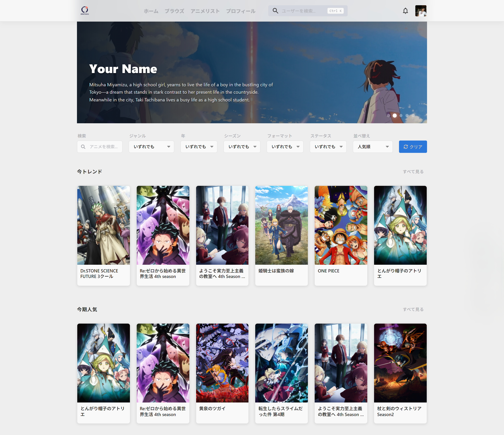
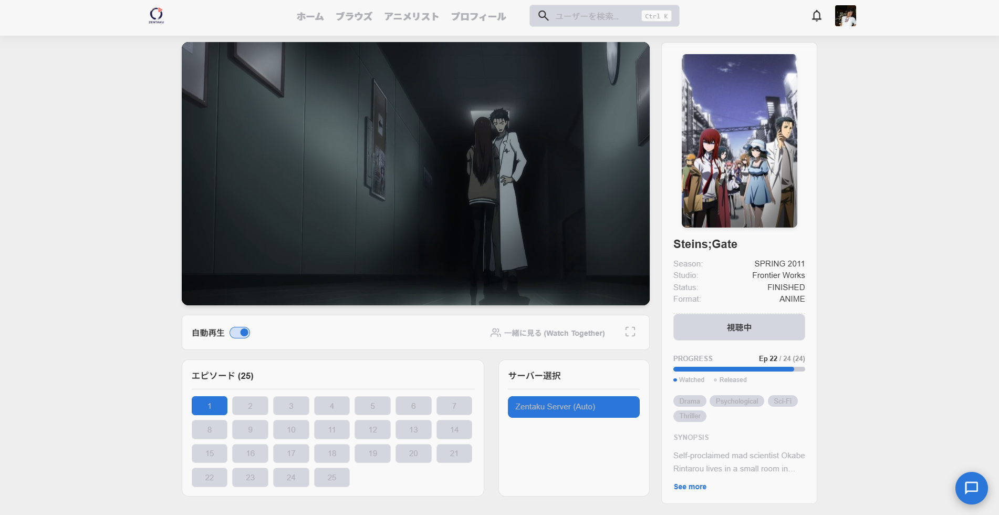
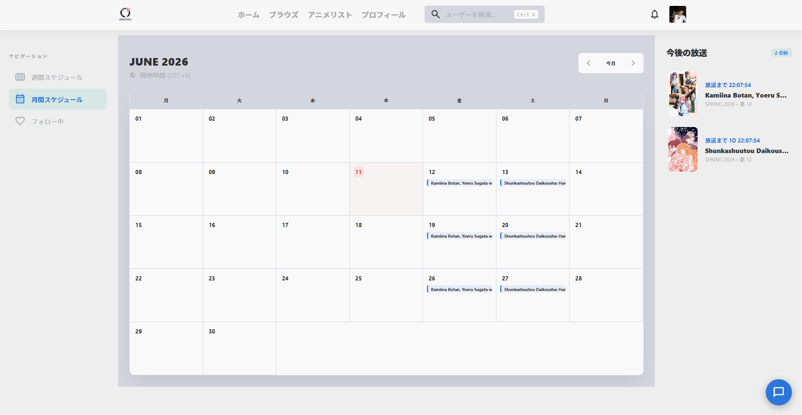
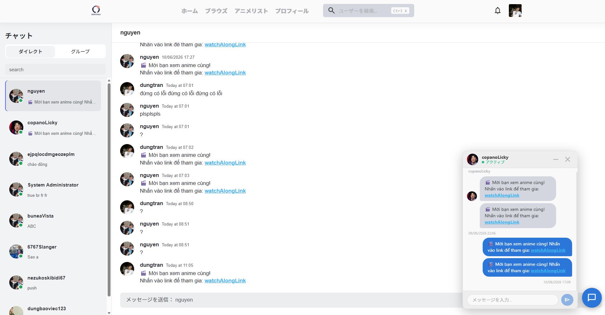
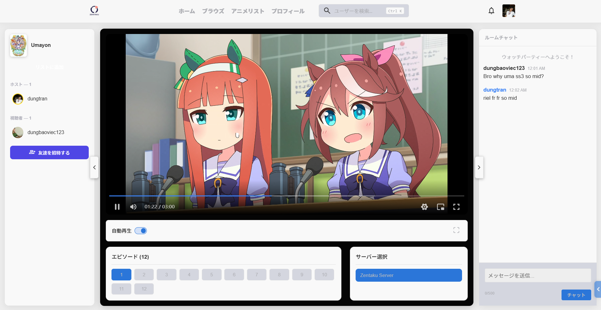
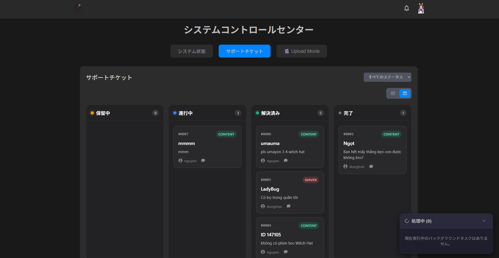

# Zentaku - Web フロントエンド

[](./README.md) [](#)

これは **Zentaku** プラットフォームのWebフロントエンドアプリケーションであり、ReactとViteを使用して構築されています。Zentakuエコシステムにアクセスするためのリッチでインタラクティブ、かつレスポンシブなユーザーインターフェースを提供します。

---

## 🌐 プロジェクトエコシステム

Zentaku は3つの主要なリポジトリに分かれた完全なシステムです：

1. **[Zentaku_BE (バックエンド)](https://github.com/itsdoanguen/Zentaku)** - コアAPIサービス。
2. **[pbl5_webFE (Webフロントエンド)](https://github.com/UmaMusumeEnjoyer/Zentaku)** - *現在位置！*
3. **[shared-logic (共有ライブラリ)](https://github.com/UmaMusumeEnjoyer/pbl5_fe_shared-logic)** - クライアント間で共有される共通の状態とロジック。
4. **[FilmServer (HLS トランスコーダ)](#)** - ローカルのHLSストリーミングおよびビデオ変換サービス。

---

## 🛠 技術スタック

- **フレームワーク:** React 19 & Vite
- **言語:** TypeScript
- **状態管理:** Zustand (`shared-logic` 経由)
- **データフェッチ:** SWR & Axios
- **メディア再生:** Artplayer, React-Player, HLS.js

- **国際化 (i18n):** i18next & react-i18next
- **UI & アイコン:** Lucide React, FontAwesome
- **コンポーネント:** React Big Calendar, React Toastify

---

## ✨ 主な機能

- **高性能ビデオ再生:** Artplayer と React-Player を使用した HLS ストリーミングと高度なコントロールをサポート。
- **多言語サポート (i18n):** 異なる言語間を動的かつシームレスに切り替え。
- **動的カレンダーとスケジュール:** イベント管理のために統合された React Big Calendar。
- **リアルタイム同期:** shared-logic モジュールを活用したリアルタイム WebSocket 通信と状態管理。
- **レスポンシブデザイン:** デスクトップおよびモバイルWebの操作に最適化。

---

## 🚀 インストールとセットアップ

### 前提条件
- Node.js (v18+)
- すべての機能を利用するには、**バックエンド (Zentaku_BE)** が実行されていることを確認してください。

### 手順

1. **リポジトリのクローン:**
   ```bash
   git clone https://github.com/UmaMusumeEnjoyer/Zentaku.git
   cd Zentaku/FE/pbl5_webFE
   ```
   *（注: 異なるフォルダ構造にクローンした場合は `cd` パスを調整してください）。*

2. **依存関係のインストール:**
   ```bash
   npm install
   ```
   *注: このプロジェクトは `@umamusumeenjoyer/shared-logic` に依存しています。正しくインストールまたはリンクされていることを確認してください。*

3. **環境設定:**
   環境ファイルの例をコピーします：
   ```bash
   cp .env.example .env
   ```
   *`.env` を編集し、API URL をローカルまたは本番のバックエンドに指定します。*

4. **開発サーバーの起動:**
   ```bash
   npm run dev
   ```
   アプリは `http://localhost:5173` (Viteのデフォルトポート) で利用可能になります。

---

## 🔑 環境変数

`.env` で必要な主要変数：

| 変数 | 説明 | 例 |
|----------|-------------|---------|
| `VITE_API_BASE_URL` | バックエンドAPIのURL | `http://localhost:3000/api` |
| `VITE_SOCKET_URL` | WebSocket接続用のURL | `http://localhost:3000` |

---

## 📁 フォルダ構成

```text
src/
├── assets/         # 静的画像、フォント、アイコン
├── components/     # 再利用可能なUIコンポーネント
├── hooks/          # カスタムReactフック
├── i18n/           # 翻訳ファイルと設定
├── pages/          # ルートコンポーネント（ビュー）
├── styles/         # グローバルスタイル / CSS
└── App.tsx         # メインアプリケーションコンポーネント
```

---

## 📸 デモとスクリーンショット

> **開発者へのメモ:** 実際のWebページのスクリーンショットをキャプチャして `docs/images/` ディレクトリに配置し、以下のプレースホルダーを置き換えてください。

### 1. ホーム / 発見ページ


### 2. アニメストリーミングプレーヤー


### 3. アニメスケジュールカレンダー


### 4. リアルタイムチャット


### 5. 同時視聴 (Watch Along)


### 6. 管理者ダッシュボード


---

## 📄 ライセンス

このプロジェクトは ISC ライセンスの下でライセンスされています。
