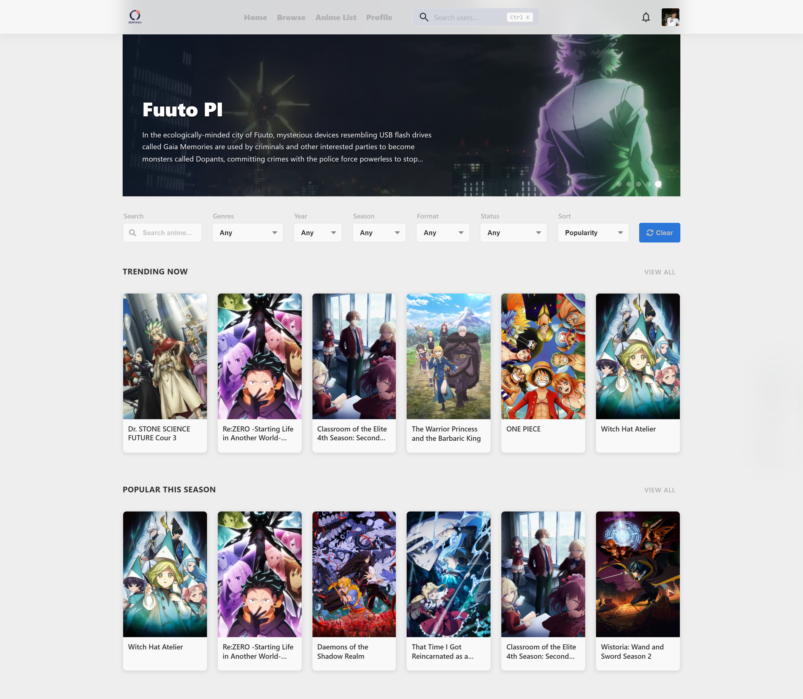
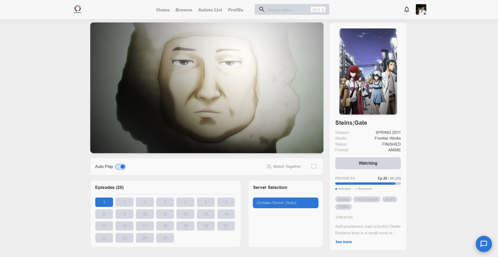
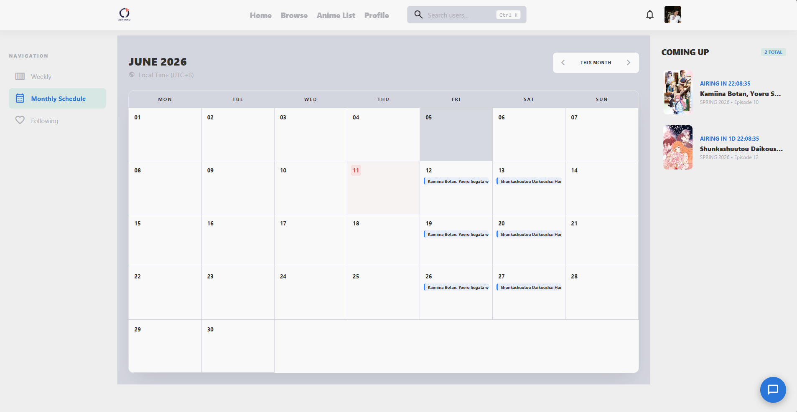
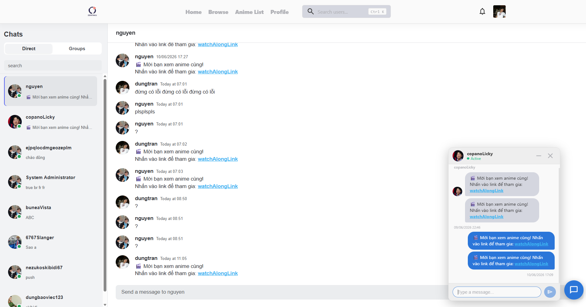
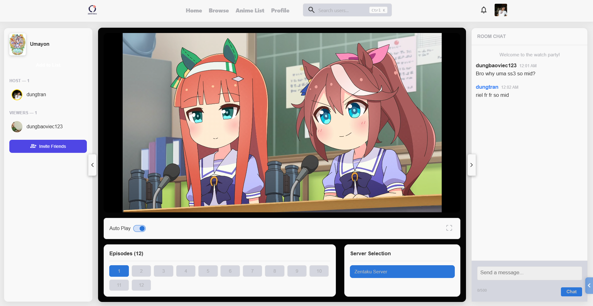
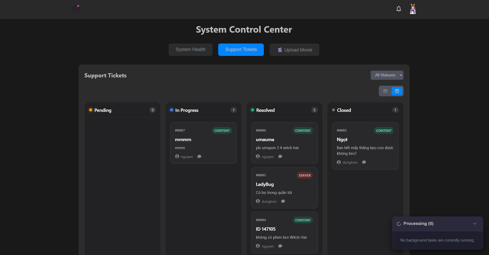

# Zentaku - Web Frontend

[](#) [](./README.ja.md)

This is the Web Frontend application for the **Zentaku** platform, built with React and Vite. It provides a rich, interactive, and responsive user interface for accessing the Zentaku ecosystem.

---

## 🌐 Project Ecosystem

Zentaku is a complete system divided into three main repositories:

1. **[Zentaku_BE (Backend)](https://github.com/itsdoanguen/Zentaku)** - The core API service.
2. **[pbl5_webFE (Web Frontend)](https://github.com/UmaMusumeEnjoyer/Zentaku)** - *You are here!*
3. **[shared-logic (Shared Library)](https://github.com/UmaMusumeEnjoyer/pbl5_fe_shared-logic)** - Common state and logic shared across clients.
4. **[FilmServer (HLS Transcoder)](#)** - Local HLS Streaming and Video Conversion service.

---

## 🛠 Tech Stack

- **Framework:** React 19 & Vite
- **Language:** TypeScript
- **State Management:** Zustand (via `shared-logic`)
- **Data Fetching:** SWR & Axios
- **Media Playback:** Artplayer, React-Player, HLS.js

- **Internationalization:** i18next & react-i18next
- **UI & Icons:** Lucide React, FontAwesome
- **Components:** React Big Calendar, React Toastify

---

## ✨ Key Features

- **High-Performance Video Playback:** Supports HLS streaming and advanced controls using Artplayer and React-Player.
- **Multilingual Support (i18n):** Seamlessly switch between different languages dynamically.
- **Dynamic Calendar & Scheduling:** Integrated React Big Calendar for managing events.
- **Real-time Syncing:** Leverages the shared-logic module for real-time WebSocket communication and state management.
- **Responsive Design:** Optimized for both desktop and mobile web experiences.

---

## 🚀 Installation & Setup

### Prerequisites
- Node.js (v18+)
- Ensure the **Backend (Zentaku_BE)** is running for full functionality.

### Steps

1. **Clone the repository:**
   ```bash
   git clone https://github.com/UmaMusumeEnjoyer/Zentaku.git
   cd Zentaku/FE/pbl5_webFE
   ```
   *(Note: Adjust the `cd` path if you cloned specifically into a different folder structure).*

2. **Install dependencies:**
   ```bash
   npm install
   ```
   *Note: This project depends on `@umamusumeenjoyer/shared-logic`. Ensure it is correctly installed or linked.*

3. **Environment Setup:**
   Copy the example environment file:
   ```bash
   cp .env.example .env
   ```
   *Edit `.env` to point your API URL to the local or production Backend.*

4. **Start the Development Server:**
   ```bash
   npm run dev
   ```
   The app will be available at `http://localhost:5173` (default Vite port).

---

## 🔑 Environment Variables

Key variables required in `.env`:

| Variable | Description | Example |
|----------|-------------|---------|
| `VITE_API_BASE_URL` | The URL of the Backend API | `http://localhost:3000/api` |
| `VITE_SOCKET_URL` | The URL for WebSocket connections | `http://localhost:3000` |

---

## 📁 Folder Structure

```text
src/
├── assets/         # Static images, fonts, icons
├── components/     # Reusable UI components
├── hooks/          # Custom React hooks
├── i18n/           # Translation files and config
├── pages/          # Route components (Views)
├── styles/         # Global styles / CSS
└── App.tsx         # Main application component
```

---

## 📸 Demo & Screenshots

> **Note to Developer:** Please capture screenshots of your actual web pages and place them in the `docs/images/` directory, then replace the placeholders below.

### 1. Home / Discover Page


### 2. Anime Streaming Player


### 3. Anime Schedule Calendar


### 4. Real-time Chat


### 5. Watch Along


### 6. Admin Dashboard


---

## 📄 License

This project is licensed under the ISC License.
